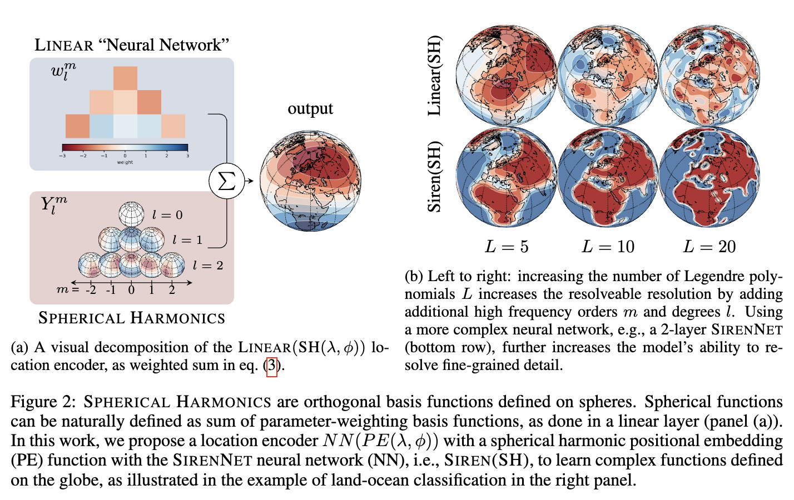
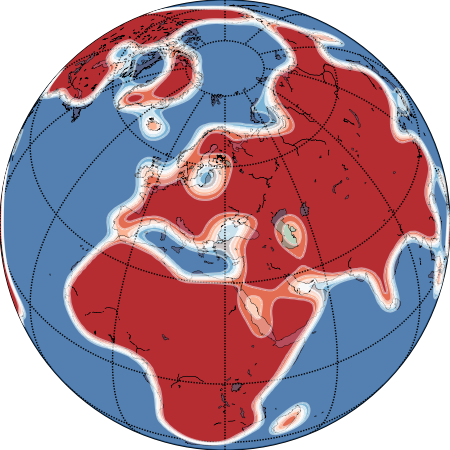
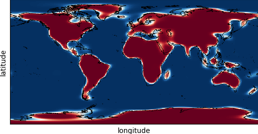

# Geographic Location Encoding with Spherical Harmonics and Sinusoidal Representation Networks



For a paper summary, please click on the youtube video below or click [this link](https://www.youtube.com/watch?v=zp0672w0D7g).

[](https://www.youtube.com/watch?v=zp0672w0D7g)

You can find the paper on [ArXiv](https://arxiv.org/abs/2310.06743) and [OpenReview](https://openreview.net/pdf?id=PudduufFLa)

if you want to cite our work, use:
```bibtex
@inproceedings{russwurm2024locationencoding,
      title={Geographic Location Encoding with Spherical Harmonics and Sinusoidal Representation Networks}, 
      author={Marc Rußwurm and Konstantin Klemmer and Esther Rolf and Robin Zbinden and Devis Tuia},
      year={2024},
      booktitle = {Proceedings of the International Conference on Learning Representations (ICLR)},
      year = {2024},
      url = {https://iclr.cc/virtual/2024/poster/18690}
}
```

## Getting Started

Check [this Colab Notebook](https://colab.research.google.com/drive/1Byil0r05MROO6peAhKOm_yy0bwuJSVhR?usp=sharing) to get started. [](https://colab.research.google.com/drive/1Byil0r05MROO6peAhKOm_yy0bwuJSVhR?usp=sharing)

It 
1. clones the current repository
2. installs the [required packages](requirements.txt)
3. trains Siren(SH) on the landocean dataset
4. predicts the following map:



## Using Siren(SH)

To use Spherical Harmonic embedding function with SirenNet, i.e., Siren(SH(lon,lat)), in your code, instantiate the `LocationEncoder` class in [locationencoder/locationencoder.py](locationencoder/locationencoder.py) with Siren and Spherical Harmonics and a hyperparameter dict `hparams` as follows:

```python
from locationencoder import LocationEncoder

hparams = dict(
    legendre_polys=10,
    dim_hidden=64,
    num_layers=2,
    optimizer=dict(lr=1e-4, wd=1e-3),
    num_classes=1
)

# Pytorch Lightning Model
model = LocationEncoder("sphericalharmonics", "siren", hparams)

# input longitude latitude in degrees
import torch
lonlat = torch.tensor([[51.9,5.6]], dtype=torch.float32)

# forward pass
output = model(lonlat)
```

## Using Spherical Harmonics

We provide the analytically calculated Spherical Harmonic Basis Functions in [locationencoder/pe/spherical_harmonics_ylm.py](locationencoder/pe/spherical_harmonics_ylm.py) up to L=100 (! 40k lines, 7.7MB source code file). This file was generated with [SymPy](https://www.sympy.org/en/index.html) using [locationencoder/pe/spherical_harmonics_generate_ylms.py](locationencoder/pe/spherical_harmonics_generate_ylms.py).

To instantiate only the Spherical Harmonic positional encoder (no trainable weights) run
```
from locationencoder.pe import SphericalHarmonics
sh = SphericalHarmonics(legendre_polys=20)

# use lonlat coordinates, as above
embedded_lonlat = sh(lonlat) 
```

## Reproduce Results

Run the following lines to reproduce results from the paper. The hyperparameter are configured in `hparams.yaml`.

Tables 1a (`--dataset checkerboard`) and 1b (`--dataset landoceandataset`) with
```bash
python experiments/exp_quantitative.py \ 
    --dataset landoceandataset \
    --nn linear fcnet siren \ 
    --pe sphericalharmonics theory grid spherec spherecplus spherem spheremplus direct cartesian3d wrap 
```

For Fig 4b) run
```bash
python experiments/exp_longitudinal_accuracy.py
```

For Fig 4a) run
```bash
python experiments/exp_resolution.py
```

## Code Acknowledgements

This repository uses and relies on
* [SymPy](https://www.sympy.org/en/index.html) for the analytic calculation of spherical harmonic basis functions
* [Pytorch Lightning](https://lightning.ai/) for smooth model fitting
* the [SirenNet implementation](https://github.com/lucidrains/siren-pytorch) ([Sitzmann et al., 2020](https://arxiv.org/abs/2006.09661)) by [
Phil Wang/lucidrains](https://github.com/lucidrains) 
